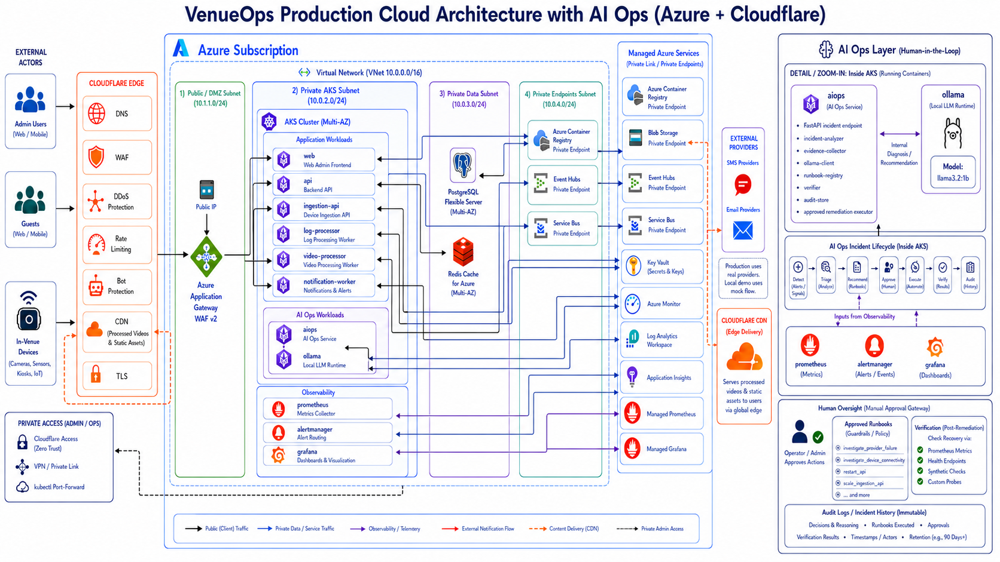
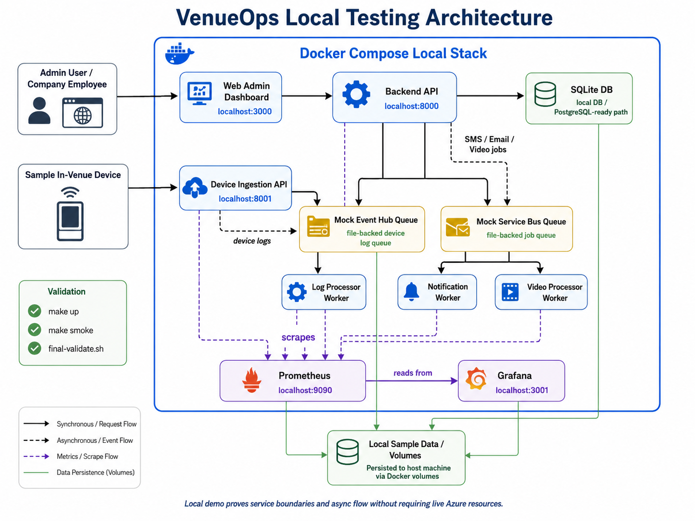
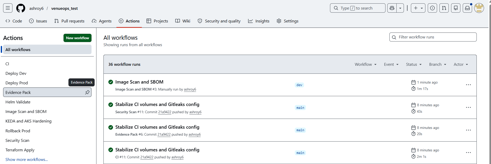
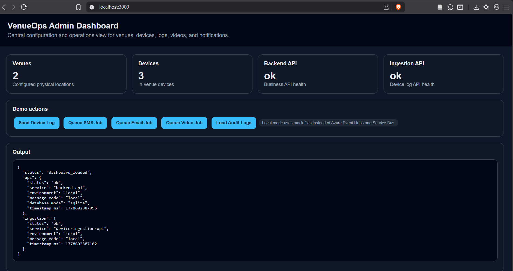
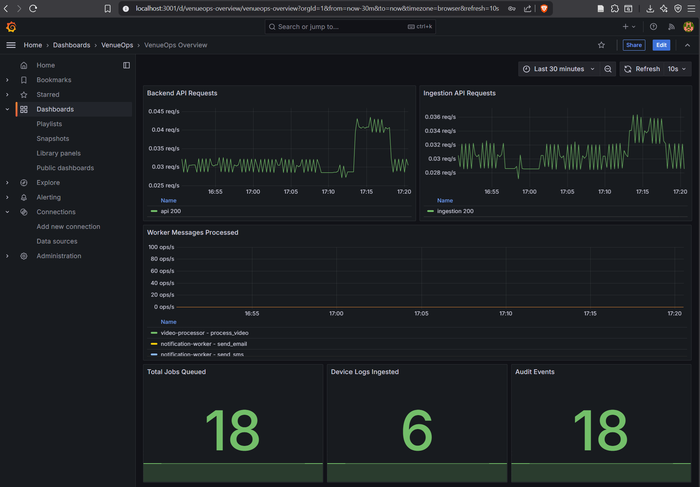
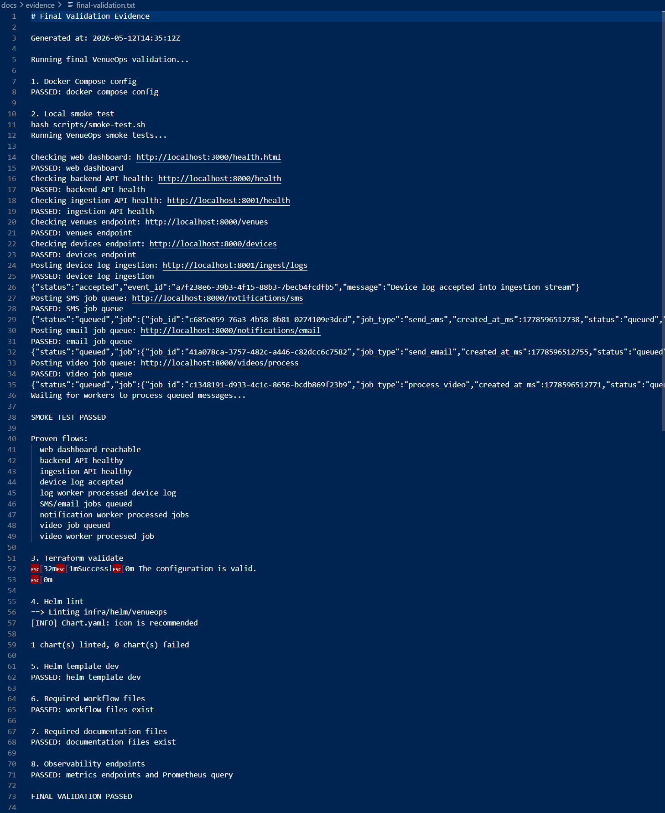

# VenueOps Agentic AI Cloud Platform — Demo README

Production-shaped DevOps demo project for a venue operations platform on **Azure + Cloudflare**, with **AKS**, **Terraform**, **Helm**, **GitHub Actions**, **Prometheus/Grafana**, and an **Agentic AI Ops incident response layer**.

This repository is not a full business product. It is an demo focused on showing cloud architecture, infrastructure automation, CI/CD, observability, security, reliability, and operational response.

---

## Index

1. [Project Summary](#project-summary)
2. [What the Demo Shows](#what-the-demo-shows)
3. [Architecture Diagrams](#architecture-diagrams)
4. [Screenshots and Proof](#screenshots-and-proof)
5. [Local Demo](#local-demo)
6. [Running Services](#running-services)
7. [Production Architecture](#production-architecture)
8. [AI Ops and Agentic AI Flow](#ai-ops-and-agentic-ai-flow)
9. [Infrastructure as Code](#infrastructure-as-code)
10. [AKS and Kubernetes](#aks-and-kubernetes)
11. [CI/CD](#cicd)
12. [Observability](#observability)
13. [Security, Scalability, and Reliability](#security-scalability-and-reliability)
14. [Repository Structure](#repository-structure)
15. [Important Commands](#important-commands)
16. [Honest Limitations](#honest-limitations)

---

## Project Summary

VenueOps is a production-shaped platform for operating physical venues.

The platform supports:

- a web admin dashboard
- backend APIs
- in-venue device/log ingestion
- asynchronous workers for logs, video, and notifications
- local Docker Compose proof
- production Azure AKS design
- Cloudflare edge protection
- Terraform infrastructure
- Helm/Kubernetes deployment packaging
- GitHub Actions CI/CD
- Prometheus and Grafana observability
- Agentic AI Ops incident detection, diagnosis, approval, remediation, verification, and audit

The local demo runs without Azure credentials. The production design maps the same services to Azure managed services and private AKS workloads.

---

## What the Demo Shows

The demo proves the main engineering patterns:

- containerized microservices
- private AKS-style workload layout
- API, ingestion, and worker separation
- event-driven and queue-based design
- observability through Prometheus and Grafana
- metric-based alerts through Prometheus and Alertmanager
- AI Ops incident response using a local LLM through Ollama
- approved runbook execution with human-in-the-loop control
- CI/CD validation with GitHub Actions
- Terraform and Helm validation
- evidence generation for demo review

---

## Architecture Diagrams

### Production Cloud Architecture with AI Ops

This is the main architecture diagram for the demo. It shows Cloudflare, Azure Application Gateway WAF, private AKS workloads, managed Azure services, observability, external providers, and the AI Ops layer.




### Local Testing Architecture

Local Docker Compose testing setup.



---

## Screenshots and Proof

### GitHub Actions Green Runs



### Local Admin Dashboard



### Grafana Dashboard



### Final Validation Evidence



---

## Local Demo

Clone the repository and enter the project directory:

```bash
git clone https://github.com/ashroy6/interview-test.git
cd interview-test
```

Start the complete local platform:

```bash
make up
```

On the first run, download the Ollama model used by the AI Ops service:

```bash
docker compose exec ollama ollama pull llama3.2:1b
```

Confirm that the model is available:

```bash
docker compose exec ollama ollama list
```

Check that all containers are running:

```bash
docker compose ps
```

Run the smoke tests:

```bash
make smoke
```

Run the full project validation:

```bash
bash scripts/final-validate.sh
```

Open the local services:

```text
Web / Admin UI:  http://localhost:3000
Backend API:     http://localhost:8000/health
Ingestion API:   http://localhost:8001/health
AI Ops API:      http://localhost:8010/health
Prometheus:      http://localhost:9090
Alertmanager:    http://localhost:9093
Grafana:         http://localhost:3001
```

Local Grafana login:

```text
Username: admin
Password: admin
```

Stop the local platform:

```bash
make down
```

The Ollama model is stored in a Docker volume, so it normally needs to be downloaded only once.

### Test Queue Backlog Incident

Use this when you want to show the agent reacting to a queue/provider style failure.

In the UI:

1. Open the VenueOps dashboard:

   ```text
   http://localhost:3000
   ```

2. Open Grafana in another browser tab:

   ```text
   http://localhost:3001
   ```

   Login:

   ```text
   username: admin
   password: admin
   ```

3. In Grafana, open the VenueOps dashboard and watch the queue/backlog panels.

4. Go back to the VenueOps dashboard and click **Generate Queue Load x10**.

5. The app creates multiple local queue jobs.

6. In Grafana, the queue/backlog graph should start going up.

7. Prometheus detects the queue backlog.

8. Alertmanager sends a `QueueBacklogHigh` alert to AI Ops.

9. The AI Ops panel in the VenueOps UI should show a new active incident.

10. Click **Show Remediation Runbook**.

11. Review the recommended runbook.

12. Click **Approve Remediation**.

13. AI Ops safely reduces/drains the local mock backlog.

14. Go back to Grafana and confirm the queue/backlog graph goes down after remediation.

15. The incident should move toward resolved/recovered state.

Expected runbook:

```text
investigate_provider_failure
```

This demonstrates metric-driven incident response. I can show the queue metric rising in Grafana, Prometheus firing the alert, Alertmanager sending it to AI Ops, and the agent recommending a pre-approved remediation runbook. After approval, the local backlog is drained and Grafana shows the metric recovering. The agent does not act blindly; it recommends, waits for approval, remediates safely, verifies recovery, and writes an audit record.

---

## Running Services

The local Docker Compose demo runs these containers:

| Service | Purpose |
|---|---|
| `web` | Admin UI / frontend |
| `api` | Backend API for venues, devices, jobs, operational demo actions |
| `ingestion-api` | Device/log ingestion API |
| `log-processor` | Processes ingested log/device events |
| `video-processor` | Processes video jobs |
| `notification-worker` | Processes SMS/email notification jobs |
| `prometheus` | Scrapes metrics and evaluates alert rules |
| `alertmanager` | Routes fired alerts to AI Ops |
| `grafana` | Dashboards and operational visibility |
| `aiops` | AI Ops incident response service |
| `ollama` | Local LLM runtime used by AI Ops |

Production mapping:

```text
Docker Compose containers
  -> AKS workloads/pods inside the private AKS subnet
```

---

## Production Architecture

Production request flow:

```text
Users / Guests / In-Venue Devices
  -> Cloudflare Edge
  -> Azure Application Gateway WAF
  -> AKS Ingress
  -> AKS workloads
```

Private AKS workloads:

```text
Application:
- web
- api
- ingestion-api
- log-processor
- video-processor
- notification-worker

Observability:
- prometheus
- alertmanager
- grafana

AI Ops:
- aiops
- ollama
```

Managed Azure services:

| Azure Service | Purpose |
|---|---|
| Azure Container Registry | Stores container images |
| Azure Blob Storage | Raw logs, uploaded videos, processed videos, static assets |
| Azure Event Hubs | High-volume device/log streaming ingestion |
| Azure Service Bus | Reliable jobs, commands, retries, and dead-lettering |
| Azure PostgreSQL | Venues, devices, jobs, config, audit data |
| Azure Cache for Redis | Hot config and device state cache |
| Azure Key Vault | Secrets, keys, certificates |
| Azure Monitor / Log Analytics | Logs, metrics, diagnostics |
| Application Insights | Application performance and tracing design |
| Managed Prometheus / Grafana | Production observability option |

Important flow examples:

```text
Device logs:
Device -> Cloudflare -> App Gateway -> ingestion-api -> Event Hubs -> log-processor

Notification jobs:
api -> Service Bus -> notification-worker -> SMS/Email provider

Video jobs:
api -> Service Bus -> video-processor -> Blob Storage -> Cloudflare CDN -> users

Metrics and incidents:
Services -> Prometheus -> Alertmanager -> aiops -> Ollama -> approved runbook -> verification -> audit
```

---

## AI Ops and Agentic AI Flow

The AI Ops service is intentionally **agentic** because it does more than generate text. It follows an operational loop:

```text
Observe -> Analyze -> Plan -> Ask for Approval -> Act -> Verify -> Audit
```

That makes it agentic AI, not just a chatbot.

### Why it is agentic AI

The AI Ops service has:

- a goal: diagnose and help recover operational incidents
- tools: Prometheus queries, evidence collection, runbook registry, verifier, audit store
- reasoning: local LLM diagnosis through Ollama
- planning: selects a safe approved runbook
- guardrails: only approved runbooks can execute
- human control: remediation requires operator approval
- action: executes safe local remediation
- verification: checks Prometheus metrics and health endpoints after action
- memory/audit: stores incident history and decisions

### AI Ops Incident Flow

```text
1. Prometheus detects a problem from metrics
2. Alertmanager sends an alert webhook to aiops
3. aiops creates an incident
4. Evidence collector gathers metrics, health status, and context
5. aiops calls Ollama for diagnosis and recommendation
6. Runbook registry matches the recommendation to approved YAML runbooks
7. Human operator reviews and approves/rejects the action in the Admin UI
8. aiops executes only the approved safe remediation
9. verifier checks recovery using metrics and health endpoints
10. audit_store records diagnosis, approval, action, verification, and timestamps
```

### AI Ops Files

```text
aiops/
├── Dockerfile
├── README.md
├── requirements.txt
├── runbooks/
│   ├── investigate_device_connectivity.yaml
│   ├── investigate_provider_failure.yaml
│   ├── restart_api.yaml
│   ├── rollback_release.yaml
│   └── scale_ingestion_api.yaml
├── src/
│   ├── audit_store.py
│   ├── config.py
│   ├── evidence_collector.py
│   ├── incident_analyzer.py
│   ├── main.py
│   ├── ollama_client.py
│   ├── prometheus_client.py
│   ├── runbook_registry.py
│   └── verifier.py
└── tests/
```

### AI Ops Demo Scenarios

The demo supports production-style incident scenarios:

| Scenario | Signal | AI Ops Recommendation | Approved Action |
|---|---|---|---|
| Queue backlog | High queue/job metric | Investigate provider failure | Drain/reduce mock backlog |
| API 5xx fault | API error/fault metric | Roll back release | Disable bad release flag |
| Device offline | Offline device metric | Investigate connectivity | Simulate heartbeat recovery |

Important demo wording:

```text
The local remediation is safe and simulated.
The workflow is real: alert -> evidence -> LLM diagnosis -> runbook -> approval -> execution -> verification -> audit.
In production, the same pattern would map to AKS, Azure Monitor, Service Bus, Event Hubs, device heartbeats, and deployment signals.
```

---

## Infrastructure as Code

Terraform lives under:

```text
infra/terraform/
```

Main Terraform areas:

```text
infra/terraform/
├── envs/
│   ├── dev/
│   ├── staging/
│   └── prod/
├── modules/
│   ├── acr/
│   ├── aks/
│   ├── application-gateway/
│   ├── cloudflare/
│   ├── event-hubs/
│   ├── key-vault/
│   ├── monitoring/
│   ├── network/
│   ├── postgresql/
│   ├── redis/
│   ├── resource-group/
│   ├── service-bus/
│   └── storage/
├── main.tf
├── providers.tf
├── variables.tf
├── outputs.tf
└── versions.tf
```

Validate Terraform:

```bash
terraform -chdir=infra/terraform validate
```

---

## AKS and Kubernetes

Helm chart:

```text
infra/helm/venueops/
```

Kubernetes manifests:

```text
infra/kubernetes/base/
infra/kubernetes/overlays/
```

Kubernetes design includes:

- Deployments
- Services
- Ingress
- HPA
- KEDA ScaledObjects
- PodDisruptionBudgets
- NetworkPolicy
- ServiceAccount
- Key Vault CSI design
- restricted pod security posture
- environment overlays for dev, staging, prod

Validate Helm:

```bash
helm lint infra/helm/venueops
```

Render Helm:

```bash
helm template venueops infra/helm/venueops --values infra/helm/venueops/values-dev.yaml
```

---

## CI/CD

GitHub Actions workflows live under:

```text
.github/workflows/
```

The pipelines cover:

- application build and smoke tests
- Docker Compose validation
- Gitleaks secret scan
- Trivy filesystem/image scan
- SBOM generation
- Checkov Terraform/IaC scan
- Terraform validate/plan/apply path
- Helm lint/template validation
- KEDA and AKS hardening checks
- deploy-dev and deploy-prod workflow paths
- rollback workflow
- evidence pack generation

Production CI/CD principle:

```text
Validation is automatic.
Production deployment is manual and approval-gated.
Rollback is manual and controlled.
```

---

## Observability

Local observability:

- Prometheus scrapes service metrics
- Alertmanager routes alerts
- Grafana shows dashboards
- services expose health and metrics endpoints
- AI Ops consumes alerts and metrics evidence

Important local ports:

```text
Prometheus:    http://localhost:9090
Alertmanager:  http://localhost:9093
Grafana:       http://localhost:3001
```

Production observability design:

- Azure Monitor
- Log Analytics
- Application Insights
- Managed Prometheus
- Managed Grafana
- OpenTelemetry path
- Prometheus alert rules
- KQL examples

Observability files:

```text
observability/
├── alertmanager/
│   └── alertmanager.yml
├── grafana/
│   ├── dashboards/
│   │   └── venueops-overview.json
│   └── provisioning/
│       ├── dashboards/
│       └── datasources/
├── log-analytics/
│   └── kql/
│       ├── api-errors.kql
│       ├── audit-events.kql
│       └── worker-processing.kql
├── otel/
│   └── README.md
└── prometheus/
    ├── prometheus.yml
    └── rules/
        └── venueops-alerts.yaml
```

---

## Security, Scalability, and Reliability

Security controls:

- Cloudflare DNS, WAF, DDoS protection, rate limiting, bot protection, CDN, TLS
- Azure Application Gateway WAF
- private AKS subnet
- private endpoints for managed services
- Key Vault for secrets
- Managed Identity / Workload Identity
- RBAC and least privilege
- Kubernetes NetworkPolicy
- Pod Security hardening
- CI security scanning
- image scanning and SBOM
- audit logs
- production approval gates

Scalability controls:

- HPA for web/API/ingestion workloads
- KEDA for queue/event-driven workers
- AKS Cluster Autoscaler
- Event Hubs partitions for high-volume ingestion
- Service Bus queues for async jobs
- Blob Storage for large logs/videos/assets
- Redis for hot cache/device state

Reliability controls:

- async queue-first processing
- retries and dead-letter design
- readiness and liveness probes
- PodDisruptionBudgets
- rollout checks
- rollback workflow
- post-deploy smoke tests
- AI Ops verification after remediation
- evidence generation

---

## Repository Structure

Current repository structure, including source files:

```text
.
├── Makefile
├── README.md
├── docker-compose.yml
├── aiops/
│   ├── Dockerfile
│   ├── README.md
│   ├── requirements.txt
│   ├── runbooks/
│   ├── src/
│   └── tests/
├── apps/
│   ├── api/
│   ├── ingestion-api/
│   ├── web/
│   └── workers/
├── config/
│   ├── dev/
│   ├── prod/
│   └── staging/
├── dist/
│   └── venueops-evidence-pack-20260512T154037Z.zip
├── docs/
│   ├── diagrams/
│   ├── evidence/
│   ├── screenshots/
│   └── *.md
├── infra/
│   ├── helm/
│   ├── kubernetes/
│   ├── policies/
│   ├── security/
│   └── terraform/
├── local/
│   ├── mock-eventhub/
│   ├── mock-servicebus/
│   ├── postgres-init/
│   └── sample-data/
├── observability/
│   ├── alertmanager/
│   ├── grafana/
│   ├── log-analytics/
│   ├── otel/
│   └── prometheus/
├── packages/
│   ├── contracts/
│   └── shared/
├── scripts/
│   ├── build-evidence-pack.sh
│   ├── final-evidence.sh
│   ├── final-validate.sh
│   ├── generate-evidence.sh
│   ├── install-keda.sh
│   ├── local-down.sh
│   ├── local-up.sh
│   ├── post-deploy-smoke.sh
│   └── smoke-test.sh
├── tests/
│   ├── integration/
│   ├── load/
│   ├── security/
│   └── smoke/
├── tools/
└── uploads/
    └── aiops-alertmanager-runbook-flow-review.zip
```

```

The repo currently contains:

```text
118 directories
120 files
```

---

## Important Commands

Start local platform:

```bash
make up
```

Stop local platform:

```bash
make down
```

Run smoke tests:

```bash
make smoke
```

Generate evidence:

```bash
make evidence
```

Run final validation:

```bash
bash scripts/final-validate.sh
```

Build evidence pack:

```bash
bash scripts/build-evidence-pack.sh
```

Validate Terraform:

```bash
terraform -chdir=infra/terraform validate
```

Validate Helm:

```bash
helm lint infra/helm/venueops
```

Render Helm:

```bash
helm template venueops infra/helm/venueops --values infra/helm/venueops/values-dev.yaml
```

---

## Honest Limitations

This is a demo, not a live production deployment.

Current limitations:

- Azure deployment has not been run end-to-end
- real Cloudflare rules are represented as design/IaC, not active production DNS/WAF config
- SMS/email providers are mocked locally
- video processing is mocked locally
- local queues simulate Event Hubs and Service Bus behavior
- local SQLite is used instead of live Azure PostgreSQL
- local Prometheus/Grafana can be replaced or extended by Azure Managed Prometheus/Grafana
- AI Ops remediation is safe and simulated locally
- production branch protection and environment approvals must be configured in GitHub settings

This is intentional for the demo. The repo proves the architecture, automation, validation, observability, and operational workflow without requiring paid cloud resources.

---

## Thanks for viewing

Ashish Dev  
ashroy6@gmail.com
