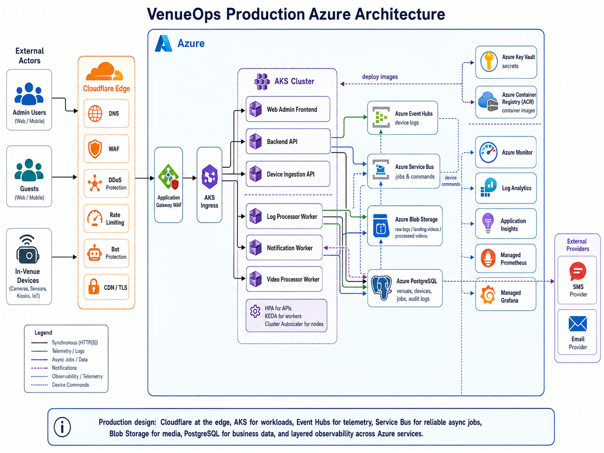

# VenueOps Cloud Platform

Production-shaped DevOps interview project for designing, deploying, securing, monitoring, and operating an Azure platform protected by Cloudflare at the edge.

This repository is intentionally built as a **cloud/platform engineering project**, not as a full business application. The app code is lightweight so the focus stays on production architecture, CI/CD, infrastructure as code, AKS deployment, observability, security, reliability, scalability, resiliency, automation, and operational evidence.

---

## Index

1. [Project Summary](#project-summary)
2. [What This Platform Supports](#what-this-platform-supports)
3. [Architecture Diagrams](#architecture-diagrams)
4. [Screenshots and Proof](#screenshots-and-proof)
5. [Local Demo](#local-demo)
6. [What the Local Demo Proves](#what-the-local-demo-proves)
7. [Production Design](#production-design)
8. [Networking and Security Design](#networking-and-security-design)
9. [Infrastructure as Code](#infrastructure-as-code)
10. [AKS and Kubernetes Deployment](#aks-and-kubernetes-deployment)
11. [CI/CD Pipelines](#cicd-pipelines)
12. [Expected CI/CD Trigger Behavior](#expected-cicd-trigger-behavior)
13. [Observability](#observability)
14. [Database and Data Flow](#database-and-data-flow)
15. [Scalability](#scalability)
16. [Reliability and Resiliency](#reliability-and-resiliency)
17. [Security Controls](#security-controls)
18. [Evidence and Validation](#evidence-and-validation)
19. [Production Readiness Additions](#production-readiness-additions)
20. [Repository Structure](#repository-structure)
21. [Important Commands](#important-commands)
22. [Honest Limitations](#honest-limitations)
23. [Interview Summary](#interview-summary)

---

## Project Summary

VenueOps is a production-shaped cloud platform design for a company operating physical venues.

The system supports:

- a web admin dashboard used by employees
- backend APIs for central configuration and operations
- ingestion of logs/events from in-venue devices
- asynchronous processing of logs, videos, notifications, and device commands
- production deployment to Azure Kubernetes Service
- edge protection through Cloudflare
- infrastructure automation through Terraform
- application deployment through Helm
- CI/CD through GitHub Actions
- local proof through Docker Compose
- observability through Prometheus, Grafana, structured logs, and Azure monitoring design
- operational evidence for interview/demo/audit review

The local version runs without Azure credentials. Production mode is designed to replace local mock services with managed Azure services.

---

## What This Platform Supports

- Web admin dashboard for central configuration
- Backend API
- Device ingestion API
- Log processor worker
- Video processor worker
- Notification worker
- Async communication between backend and devices
- SMS/email notification jobs
- Video processing jobs
- Device log/event ingestion
- Audit logging
- Local Docker Compose demo
- Terraform infrastructure code
- Helm AKS deployment packaging
- KEDA worker autoscaling definitions
- HPA API autoscaling definitions
- GitHub Actions CI/CD
- Security scanning
- Image scanning and SBOM generation
- Evidence pack generation
- Local Prometheus and Grafana dashboards

---

## Architecture Diagrams

### Production Cloud / Network Architecture

This is the most detailed production cloud diagram. It includes the Azure subscription, VNet, public/DMZ subnet, private AKS subnet, private data subnet, private endpoints subnet, Cloudflare, Application Gateway WAF, AKS workloads, Azure managed services, observability, and external providers.


### Production Azure Architecture

This diagram shows the high-level production Azure design with Cloudflare at the edge, Application Gateway WAF, AKS workloads, Event Hubs, Service Bus, Blob Storage, PostgreSQL, Key Vault, ACR, and Azure observability services.



### Local Testing Architecture

This diagram shows the local Docker Compose testing setup with local services, mock queues, SQLite, Prometheus, Grafana, and validation flow.


---

## Screenshots and Proof

### GitHub Actions Green Runs

The repository includes CI/CD workflows for app validation, security scanning, image scanning/SBOM, Terraform validation, Helm validation, deployment rendering, rollback, and evidence packaging.


### Local Admin Dashboard

The local web dashboard proves the frontend, backend API, ingestion API, and demo actions are running through Docker Compose.


### Grafana Dashboard

The local Grafana dashboard proves Prometheus is scraping application and worker metrics.


### Final Validation Evidence

The final validation file proves Docker Compose config, smoke test, Terraform validation, Helm lint, Helm template rendering, workflow file checks, documentation checks, and observability endpoint checks all passed.


---

## Local Demo

The local demo runs with Docker Compose.

Start the platform:

```bash
make up
```

Run the smoke test:

```bash
make smoke
```

Generate local evidence:

```bash
make evidence
```

Run full final validation:

```bash
bash scripts/final-validate.sh
```

Generate final evidence:

```bash
bash scripts/final-evidence.sh
```

Open locally:

```text
Web dashboard:  http://localhost:3000
Backend API:    http://localhost:8000/health
Ingestion API:  http://localhost:8001/health
Prometheus:     http://localhost:9090
Grafana:        http://localhost:3001
```

Grafana login in local mode:

```text
username: admin
password: admin
```

---

## What the Local Demo Proves

The local smoke test proves:

- web dashboard is reachable
- backend API is healthy
- ingestion API is healthy
- venues endpoint works
- devices endpoint works
- device logs can be accepted
- log processor handles device logs
- SMS jobs can be queued
- email jobs can be queued
- notification worker processes jobs
- video jobs can be queued
- video worker processes jobs
- observability endpoints are exposed
- Prometheus can query service availability

Local mode uses mock queues:

```text
Mock Event Hub      = local file-backed device log queue
Mock Service Bus    = local file-backed job queue
SQLite              = local DB / PostgreSQL-ready path
Prometheus/Grafana  = local observability proof
```

In production, these are replaced by Azure managed services:

```text
Mock Event Hub   -> Azure Event Hubs
Mock Service Bus -> Azure Service Bus
SQLite           -> Azure PostgreSQL
Local volumes    -> Azure Blob Storage / managed persistence
Local Grafana    -> Managed Grafana / production observability stack
```

---

## Production Design

Production traffic flow:

```text
Users / guests / in-venue devices
  -> Cloudflare Edge
  -> Azure Application Gateway WAF
  -> AKS Ingress
  -> AKS workloads
```

AKS workloads:

- Web Admin Frontend
- Backend API
- Device Ingestion API
- Log Processor Worker
- Video Processor Worker
- Notification Worker

Azure managed services:

- Azure Event Hubs for high-volume device logs and telemetry-style ingestion
- Azure Service Bus for reliable async jobs and device commands
- Azure Blob Storage for raw logs, uploaded videos, processed videos, and static/media assets
- Azure PostgreSQL for venues, devices, jobs, configuration, guests, and audit logs
- Azure Redis for hot configuration and device state
- Azure Key Vault for secrets and certificates
- Azure Container Registry for container images
- Azure Monitor for Azure resource monitoring
- Log Analytics for centralized logs and KQL analysis
- Application Insights for application performance and tracing design
- Managed Prometheus for metrics
- Managed Grafana for dashboards

External providers:

- SMS provider
- Email provider
- Cloudflare CDN for static assets and processed media delivery

---

## Networking and Security Design

The production cloud architecture uses explicit network segmentation.

Azure VNet:

```text
Virtual Network: 10.0.0.0/16
```

Subnets:

```text
Public / DMZ Subnet:        10.0.1.0/24
Private AKS Subnet:         10.0.2.0/24
Private Data Subnet:        10.0.3.0/24
Private Endpoints Subnet:   10.0.4.0/24
```

Public / DMZ subnet contains:

- Public IP
- Azure Application Gateway WAF v2

Private AKS subnet contains:

- AKS cluster
- Kubernetes ingress
- app workloads
- HPA
- KEDA
- Cluster Autoscaler
- Workload Identity
- system/user node pools

Private data subnet contains:

- PostgreSQL Flexible Server
- Redis Cache

Private endpoints subnet contains private endpoints for:

- Blob Storage
- Key Vault
- Service Bus
- Event Hubs
- Azure Container Registry

Security design includes:

- Cloudflare WAF/DDoS/rate limiting/bot protection/CDN/TLS
- Azure Application Gateway WAF
- private subnets
- private endpoints
- Key Vault secrets
- Managed Identity / Workload Identity
- RBAC and least privilege
- Kubernetes NetworkPolicy
- Pod Security restricted namespace labels
- audit logs
- security scanning
- image scanning
- SBOM generation

---

## Infrastructure as Code

Terraform lives under:

```text
infra/terraform/
```

Validate Terraform:

```bash
terraform -chdir=infra/terraform validate
```

Terraform modules include:

- Resource Group
- Network
- AKS
- ACR
- Key Vault
- Storage Account
- Event Hubs
- Service Bus
- PostgreSQL
- Redis design path for hot config and device state
- Monitoring
- Application Gateway WAF
- Cloudflare design marker
- Private DNS / private endpoint design path
- Managed Identity / role assignment design path

Terraform covers the production foundation and validates locally without requiring a live Azure deployment.

---

## AKS and Kubernetes Deployment

Helm chart lives under:

```text
infra/helm/venueops/
```

Validate Helm:

```bash
helm lint infra/helm/venueops
```

Render Helm manifests:

```bash
helm template venueops infra/helm/venueops --values infra/helm/venueops/values-dev.yaml
```

The Helm chart includes:

- Deployments
- Services
- Ingress
- ConfigMap
- ServiceAccount
- HPA
- KEDA ScaledObjects
- TriggerAuthentication
- PodDisruptionBudgets
- NetworkPolicy
- SecretProviderClass for Key Vault CSI integration
- resource requests and limits
- rollout-ready Kubernetes manifests

AKS hardening includes:

- restricted namespace labels
- service account for workload identity
- Key Vault CSI design
- KEDA worker autoscaling
- HPA API autoscaling
- Cluster Autoscaler design
- PDBs
- NetworkPolicy
- RBAC design
- audit and diagnostics design

---

## CI/CD Pipelines

GitHub Actions workflows live under:

```text
.github/workflows/
```

Workflow use cases:

| Pipeline | Purpose |
|---|---|
| CI | Builds Docker Compose stack, starts services, runs smoke tests, checks observability endpoints |
| Security Scan | Runs Gitleaks, Trivy filesystem scan, and Checkov Terraform scan |
| Image Scan and SBOM | Builds Docker images, scans images, and generates SBOM artifacts |
| Terraform Validate | Checks Terraform formatting, init, and validation |
| Terraform Plan | Records/validates Terraform plan path for review before apply |
| Terraform Apply | Manual infrastructure deployment workflow guarded by environment approval and Azure enablement flag |
| Helm Validate | Lints and renders Kubernetes manifests |
| KEDA and AKS Hardening | Validates KEDA objects, TriggerAuthentication, ServiceAccount, and AKS hardening manifests |
| Deploy Dev | Manual dev deployment/render workflow; can deploy to AKS when Azure variables exist |
| Deploy Prod | Manual production deployment workflow with production environment approval |
| Rollback Prod | Manual Helm rollback workflow for production recovery |
| Evidence Pack | Builds a downloadable evidence bundle for review/audit/interview |

Production CI/CD principle:

```text
Validation pipelines run automatically.
Production deployment pipelines are manual and approval-gated.
Rollback is manual.
```

---

## Expected CI/CD Trigger Behavior

Not every workflow runs on every push. This is intentional.

The repository uses path-based triggers so GitHub Actions only runs the workflows relevant to the files that changed. This keeps CI faster, cheaper, and closer to real production practice.

| Workflow | Runs Automatically When | Manual Run |
|---|---|---|
| CI | Push or PR to `main` / `dev` | Yes |
| Security Scan | Push or PR to `main` / `dev` | Yes |
| Evidence Pack | Docs, infra, workflow, script, or observability files change | Yes |
| Terraform Validate | Terraform files change under `infra/terraform/**` | Yes |
| Terraform Plan | Pull request with Terraform changes, or manual trigger | Yes |
| Terraform Apply | Never automatically | Yes, with approval and Azure variables |
| Helm Validate | Helm files change under `infra/helm/**` | Yes |
| KEDA and AKS Hardening | Helm, Kubernetes, or KEDA-related files change | Yes |
| Image Scan and SBOM | Application code, Dockerfiles, or Docker Compose changes | Yes |
| Deploy Dev | Never automatically in this local/interview setup | Yes |
| Deploy Prod | Never automatically | Yes, with production approval |
| Rollback Prod | Never automatically | Yes |

### Why only some pipelines run after a push

Example:

- If only `README.md` or screenshots change, Terraform and Helm validation do not need to run.
- If Terraform files change, Terraform Validate and Terraform Plan run.
- If Helm chart files change, Helm Validate and KEDA/AKS Hardening run.
- If application code changes, CI and Image Scan/SBOM run.
- Production deployment and rollback are manual by design.

This follows the production rule:

```text
Validation = automatic when relevant
Deployment = controlled/manual
Production = approval-gated
Rollback = manual emergency action
```

---

## Observability

Local observability:

- Prometheus runs locally on port `9090`
- Grafana runs locally on port `3001`
- Backend API exposes `/metrics`
- Ingestion API exposes `/metrics`
- Workers expose Prometheus metrics ports
- Grafana dashboard is provisioned automatically
- structured JSON logs are emitted by services/workers
- evidence files capture validation output

Production observability design:

- Azure Monitor for Azure resources
- Log Analytics for centralized logs
- Application Insights for app performance/tracing design
- Managed Prometheus for metrics
- Managed Grafana for dashboards
- OpenTelemetry design path
- Prometheus alert rules
- KQL examples for log analysis
- audit logs for business/security actions

Important metrics:

- API request count
- API latency
- API error rate
- ingestion request count
- device logs ingested
- jobs queued
- worker messages processed
- audit events recorded
- Prometheus target health

---

## Database and Data Flow

Local mode:

```text
DATABASE_MODE=sqlite
DATABASE_URL=sqlite:////data/db/venueops.db
```

Production mode:

```text
DATABASE_MODE=postgres
DATABASE_URL=<from Azure Key Vault / production secret injection>
```

Database-backed entities:

- venues
- devices
- jobs
- audit logs

Data flow examples:

Device log flow:

```text
In-venue device
  -> Cloudflare
  -> Application Gateway WAF
  -> Device Ingestion API
  -> Event Hubs
  -> Log Processor Worker
  -> Blob Storage / PostgreSQL / logs
```

Notification flow:

```text
Backend API
  -> Service Bus
  -> Notification Worker
  -> SMS / Email provider
  -> audit/job status
```

Video flow:

```text
Backend API
  -> Service Bus
  -> Video Processor Worker
  -> Blob Storage
  -> Cloudflare CDN
  -> Guest
```

Configuration/admin flow:

```text
Admin User
  -> Web Admin Dashboard
  -> Backend API
  -> PostgreSQL / Redis / Audit Logs
```

---

## Scalability

API scaling:

- Web, backend API, and ingestion API scale horizontally using HPA.
- HPA can scale based on CPU/memory and future custom metrics.

Worker scaling:

- Workers scale using KEDA.
- KEDA scales workers based on Event Hub backlog or Service Bus queue length.

Node scaling:

- AKS Cluster Autoscaler adds or removes nodes based on pending pods and capacity requirements.

Storage scaling:

- Blob Storage handles large files, raw logs, landing videos, and processed videos.

Database scaling:

- PostgreSQL can scale by SKU, storage, indexing, connection pooling, and read replicas if needed.

Event scaling:

- Event Hubs partitions support high-volume device event ingestion.
- Service Bus queues isolate different business job types.

---

## Reliability and Resiliency

Reliability controls:

- multiple replicas
- readiness probes
- liveness probes
- PodDisruptionBudgets
- queue-based asynchronous processing
- retry/dead-letter design for Service Bus
- Event Hubs consumer design
- deployment rollout checks
- post-deploy smoke test script
- rollback workflow
- evidence generation

Resiliency principles:

- devices may be offline
- providers may fail
- workers may crash
- nodes may be replaced
- video jobs may take time
- messages should be retried or dead-lettered
- APIs should not block on slow downstream providers

---

## Security Controls

Security controls included or designed:

- Cloudflare DNS/WAF/DDoS/rate limiting/bot protection/CDN/TLS
- Azure Application Gateway WAF
- Azure Key Vault
- Managed Identity / Workload Identity
- private endpoints
- network segmentation
- Kubernetes NetworkPolicy
- Pod Security restricted namespace
- RBAC and least privilege
- no long-lived Azure credentials in code
- GitHub OIDC design for Azure login
- Gitleaks secret scanning
- Trivy filesystem scanning
- Trivy image scanning
- SBOM generation
- Checkov Terraform/IaC scanning
- environment approval for production
- branch protection guidance
- audit logs

---

## Evidence and Validation

Evidence files live under:

```text
docs/evidence/
```

Evidence includes:

- local smoke test output
- backend API health
- ingestion API health
- worker evidence
- Terraform validation
- Helm lint output
- GitHub Actions workflow inventory
- Prometheus targets
- final validation
- final project tree
- final docs inventory
- final Terraform/Helm files inventory

Run full validation:

```bash
bash scripts/final-validate.sh
```

Expected result:

```text
FINAL VALIDATION PASSED
```

Build evidence pack:

```bash
bash scripts/build-evidence-pack.sh
```

---

## Production Readiness Additions

This repo includes production-readiness workflows and docs:

- Image scan and SBOM workflow
- Terraform plan workflow
- Terraform apply workflow with environment approval
- Production rollback workflow
- Evidence pack workflow
- Branch protection guidance
- Production approval guidance
- Post-deploy smoke test script
- Gitleaks config for safe documentation placeholders
- CI volume isolation for stable Docker Compose runs in GitHub Actions

Review:

- `docs/branch-protection.md`
- `docs/production-approval.md`
- `docs/submission-checklist.md`
- `docs/final-interview-script.md`

---

## Repository Structure

High-level structure:

```text
.
├── apps/
│   ├── web/
│   ├── api/
│   ├── ingestion-api/
│   └── workers/
├── infra/
│   ├── terraform/
│   ├── helm/
│   ├── kubernetes/
│   ├── policies/
│   └── security/
├── observability/
│   ├── prometheus/
│   ├── grafana/
│   ├── log-analytics/
│   └── otel/
├── docs/
│   ├── diagrams/
│   ├── screenshots/
│   ├── evidence/
│   └── *.md
├── scripts/
├── tests/
├── .github/workflows/
├── docker-compose.yml
├── Makefile
└── README.md
```

---

## Important Commands

Start local platform:

```bash
make up
```

Stop local platform:

```bash
make down
```

Run smoke test:

```bash
make smoke
```

Generate evidence:

```bash
make evidence
```

Run final validation:

```bash
bash scripts/final-validate.sh
```

Build evidence pack:

```bash
bash scripts/build-evidence-pack.sh
```

Validate Terraform:

```bash
terraform -chdir=infra/terraform validate
```

Validate Helm:

```bash
helm lint infra/helm/venueops
```

Render Helm:

```bash
helm template venueops infra/helm/venueops --values infra/helm/venueops/values-dev.yaml
```

Run local Gitleaks scan:

```bash
gitleaks detect --source . --no-git --config .gitleaks.toml --redact --verbose
```

---

## Honest Limitations

This project is production-shaped and strongly validated locally, but it is not a live Azure deployment.

Not completed in this local interview repo:

- live Azure deployment has not been run
- real Cloudflare DNS/WAF/rate-limit rules are not enabled
- real Azure Key Vault secret mounting requires live AKS + CSI driver + identity
- real KEDA scaling requires live AKS + KEDA + Azure queues/event hubs
- real SMS/email provider integration is mocked locally
- real video transcoding is mocked locally
- production branch protection must be enabled in GitHub repository settings
- production environment approval must be configured in GitHub repository settings
- Terraform apply requires real Azure OIDC and remote backend configuration

This is intentional. The repo proves architecture, service boundaries, CI/CD, IaC, deployment packaging, observability, and validation without requiring paid cloud resources.

---

## Interview Summary

I built a production-shaped Azure DevOps platform repo for VenueOps.

The local stack proves the service flow using Docker Compose, mock queues, SQLite, Prometheus, and Grafana.

Terraform validates the Azure infrastructure design.

Helm validates the AKS deployment package.

GitHub Actions validates CI, security, image scanning, SBOM, Terraform, Helm, KEDA/AKS hardening, deployment rendering, rollback path, and evidence packaging.

The architecture uses Cloudflare at the edge, Azure Application Gateway WAF, private AKS, private data subnet, private endpoints, Azure Event Hubs, Azure Service Bus, Blob Storage, PostgreSQL, Key Vault, ACR, Azure Monitor, Log Analytics, Application Insights, Managed Prometheus, and Managed Grafana.

The project demonstrates cloud/platform engineering thinking across security, scalability, reliability, resiliency, observability, automation, and audit evidence.
